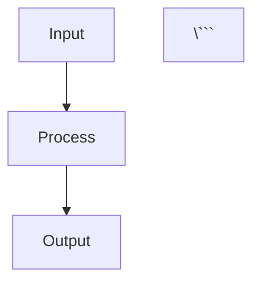
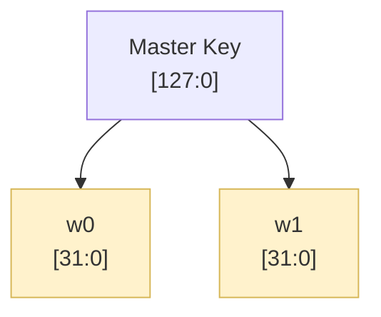
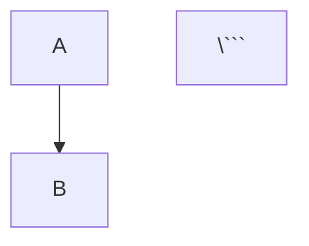

# Code-Based Architecture Diagrams

This directory contains **code-based** diagram solutions that you can edit and generate programmatically.

## 📁 Files

1. **architecture_diagrams.mmd** - Mermaid diagrams (Markdown-compatible)
2. **generate_diagrams.py** - Python script to generate PNG/SVG diagrams
3. **requirements.txt** - Python dependencies

## 🎯 Quick Start

### Option 1: Mermaid Diagrams (Easiest)

Mermaid diagrams are **code-based** and render automatically in:
- GitHub/GitLab markdown
- VS Code (with Mermaid extension)
- Many markdown editors
- Online at https://mermaid.live/

**View in GitHub:**
Just view the `.mmd` file or include in markdown:

```markdown
# My Architecture



**Edit Online:**
1. Go to https://mermaid.live/
2. Copy content from `architecture_diagrams.mmd`
3. Edit the code
4. Export as PNG/SVG/PDF

**VS Code:**
1. Install "Markdown Preview Mermaid Support" extension
2. Open `architecture_diagrams.mmd`
3. Press `Ctrl+Shift+V` to preview

**Export to PNG/SVG:**
```bash
# Install mermaid-cli
npm install -g @mermaid-js/mermaid-cli

# Generate PNG
mmdc -i architecture_diagrams.mmd -o diagram.png

# Generate SVG
mmdc -i architecture_diagrams.mmd -o diagram.svg
```

### Option 2: Python + Graphviz (Full Control)

Generate diagrams programmatically using Python.

**Install dependencies:**
```bash
# Install system package
sudo apt-get install graphviz        # Ubuntu/Debian
# or
brew install graphviz                # macOS
# or download from graphviz.org      # Windows

# Install Python package
pip install -r requirements.txt
# or
pip install graphviz
```

**Generate diagrams:**
```bash
python generate_diagrams.py
```

**Output files:**
- `key_expansion_diagram.png` - Key expansion module
- `key_expansion_diagram.svg` - Key expansion (vector)
- `datapath_diagram.png` - 32-bit datapath
- `datapath_diagram.svg` - Datapath (vector)

## 📝 Editing Diagrams

### Mermaid Code Example

The Mermaid diagrams are defined in **plain text code**:



**To modify:**
1. Edit the `.mmd` file in any text editor
2. Change node labels, connections, or styling
3. Preview changes in VS Code or mermaid.live
4. Export to image format

### Python Code Example

The Python script uses Graphviz library:

```python
from graphviz import Digraph

dot = Digraph()
dot.node('A', 'Master Key', fillcolor='#fff2cc')
dot.node('B', 'w0 [31:0]', fillcolor='#fff2cc')
dot.edge('A', 'B')

dot.render('my_diagram', format='png')
```

**To modify:**
1. Edit `generate_diagrams.py`
2. Add/remove nodes with `dot.node()`
3. Add/remove edges with `dot.edge()`
4. Run script to regenerate diagrams

## 🎨 Customization

### Mermaid Customization

**Change colors:**
```mermaid
classDef myStyle fill:#ff0000,stroke:#333,stroke-width:2px
class NodeName myStyle
```

**Change direction:**
```mermaid
graph LR  %% Left to Right
graph TB  %% Top to Bottom
graph RL  %% Right to Left
graph BT  %% Bottom to Top
```

**Add subgraphs:**
```mermaid
subgraph SubgraphName["Display Name"]
    Node1
    Node2
end
```

### Python Customization

**Change node style:**
```python
dot.node('id', 'Label',
         fillcolor='#color',
         shape='box',          # box, circle, ellipse, etc.
         style='rounded,filled',
         fontsize='12')
```

**Change edge style:**
```python
dot.edge('from', 'to',
         color='red',
         style='dashed',       # solid, dashed, dotted
         label='edge label')
```

**Change layout:**
```python
dot.attr(rankdir='TB')         # Top to Bottom
dot.attr(rankdir='LR')         # Left to Right
dot.attr(splines='ortho')      # Orthogonal edges
```

## 📊 Diagram Types

### 1. Key Expansion Module
Shows the on-the-fly key expansion architecture with:
- Current 4-word window
- RotWord and SubWord operations
- XOR chain for next round generation
- Feedback loops
- Control signals

### 2. 32-bit Datapath
Shows the complete AES core datapath with:
- State register (4 columns)
- Column selector
- Shared SubBytes (4 S-boxes)
- ShiftRows, MixColumns, AddRoundKey
- Key management system
- Control FSM

### 3. Encryption Flow (Mermaid only)
Shows the round-by-round processing timeline.

## 🔧 Troubleshooting

### Mermaid Issues

**"Diagram not rendering"**
- Check syntax at https://mermaid.live/
- Ensure VS Code has Mermaid extension
- GitHub renders `.mmd` files automatically

**"Export not working"**
- Install mermaid-cli: `npm install -g @mermaid-js/mermaid-cli`
- Check Node.js is installed: `node --version`

### Python Issues

**"graphviz not found"**
- Install system package first (see installation above)
- Then install Python package: `pip install graphviz`

**"Module not found"**
```bash
pip install graphviz
```

**"Command not found: python"**
```bash
python3 generate_diagrams.py
```

## 🚀 Integration Examples

### In Markdown/README:
```markdown
# Architecture



### In LaTeX:
```latex
\begin{figure}[h]
  \centering
  \includegraphics[width=0.9\textwidth]{key_expansion_diagram.png}
  \caption{Key Expansion Module}
\end{figure}
```

### In Jupyter Notebook:
```python
from IPython.display import Image
Image('datapath_diagram.png')
```

### Automated Generation:
```bash
# Add to CI/CD pipeline
python generate_diagrams.py
git add *.png *.svg
git commit -m "Update diagrams"
```

## 🆚 Comparison: Mermaid vs Python

| Feature | Mermaid | Python/Graphviz |
|---------|---------|-----------------|
| **Code-based** | ✅ Yes | ✅ Yes |
| **GitHub rendering** | ✅ Auto-renders | ❌ Need export |
| **VS Code preview** | ✅ With extension | ❌ Need export |
| **Customization** | ⭐⭐⭐ Good | ⭐⭐⭐⭐⭐ Excellent |
| **Learning curve** | ⭐⭐⭐⭐⭐ Easy | ⭐⭐⭐ Moderate |
| **Output formats** | PNG, SVG, PDF | PNG, SVG, PDF, many more |
| **Programmatic** | ❌ Manual code | ✅ Can generate from data |
| **Layout control** | ⭐⭐⭐ Automatic | ⭐⭐⭐⭐ More control |

## 💡 Recommendations

- **For documentation**: Use Mermaid (renders in GitHub)
- **For papers/reports**: Use Python → export PNG/SVG
- **For presentations**: Use either, export to high-res PNG
- **For automation**: Use Python (can generate from code analysis)
- **For quick edits**: Use Mermaid (easier to modify)

## 📚 Resources

### Mermaid
- Official docs: https://mermaid.js.org/
- Live editor: https://mermaid.live/
- Syntax guide: https://mermaid.js.org/intro/syntax-reference.html

### Graphviz
- Official site: https://graphviz.org/
- Python docs: https://graphviz.readthedocs.io/
- Gallery: https://graphviz.org/gallery/

### Examples
- Mermaid examples: https://mermaid.js.org/ecosystem/integrations.html
- Graphviz examples: https://graphs.grevian.org/

## 🎯 Quick Commands Reference

```bash
# Mermaid
mmdc -i input.mmd -o output.png              # Generate PNG
mmdc -i input.mmd -o output.svg              # Generate SVG
mmdc -i input.mmd -o output.pdf              # Generate PDF

# Python
python generate_diagrams.py                   # Generate all diagrams
pip install graphviz                          # Install Python package
sudo apt-get install graphviz                 # Install system package (Ubuntu)

# View
code architecture_diagrams.mmd                # Edit in VS Code
open key_expansion_diagram.png                # View output
```

## ✨ Advantages of Code-Based Diagrams

1. **Version Control**: Diff-friendly, track changes
2. **Reproducible**: Same code → same diagram
3. **Automated**: Generate from data/analysis
4. **Collaborative**: Easy to review and merge
5. **No Binary Files**: Text-based, works everywhere
6. **CI/CD Integration**: Auto-update on code changes
7. **Documentation as Code**: Keep docs in sync with code
